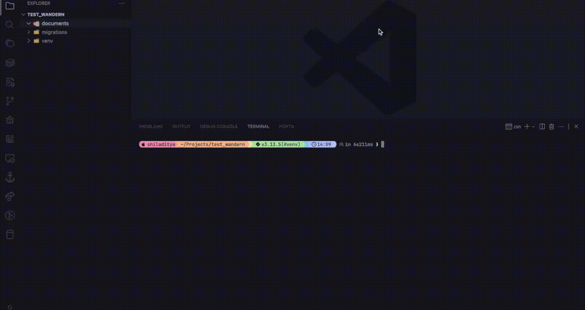
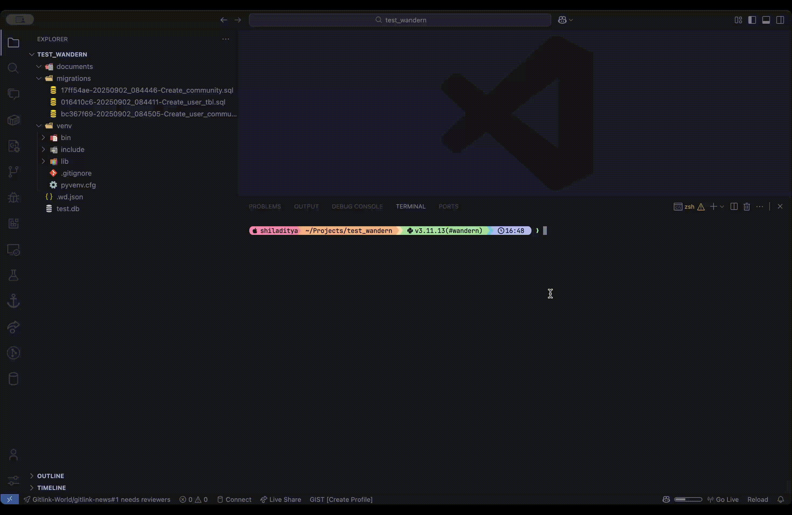

# Wandern
<div align="center">
    <p>
      <a href="https://codecov.io/gh/s-bose/wandern" >
         </a>
      <a href="https://github.com/s-bose/wandern/actions/workflows/tests.yml">
         </a>
      <a href="https://www.codefactor.io/repository/github/s-bose/wandern">
         
      </a>
    </p>
</div>

Wandern is a database migration tool written in Python.
Wandern provides a simple, straight-forward interface for creating and managing migrations with plain SQL files, giving you the flexibility to add your own SQL statements.


## Installation

**PIP**

```bash
pip install wandern
```

**UV**

```bash
uv add wandern
```

**Using postgresql**
In order to use postgresql, you need to install extra dependencies.

**PIP**

```bash
pip install "wandern[postgresql]"
```

**UV**

```bash
uv add wandern --extra postgresql
```

## Quick Start

1. Initialize wandern in your project:
   ```bash
   wandern init
   ```

This creates a `.wd.json` file in your current working directory. You can specify an optional migration directory (default: `wd_migrations` inside current directory).
Here is an example `.wd.json` configuration

```json
{
  "dsn": "",
  "migration_dir": "/Users/<username>/<project_dir>/wd_migrations",
  "file_format": "{version}-{datetime:%Y%m%d_%H%M%S}-{message}",
  "migration_table": "wd_migrations"
}
```
- `dsn` - The connection string of the database you want to apply your migrations to. Currently only supports sqlite and postgresql
    - `Sqlite` - dsn should start with `sqlite://`
    - `Postgresql` - dsn should start with `postgresql://`
- `migration_dir` - The directory where the generated migration files will be stored. You can configure it later.
- `file_format` - a python f-string format specifying the format of the generated filename.

**Available settings**
- `version` - specify the version (autogenerated 8-character ID)
- `slug` - a base64 encoded message slug
- `message` - migration message provided during generating a new file.
- `author` - name of the author provided during generating a new file.
- `epoch` - the current POSIX timestamp
- `datetime` - the current datetime (can be formatted using standard python datetime strftime format)

2. Generate your first migration:
   ```bash
   wandern generate --message "create users table"
   ```

This will create a new empty migration file in your migration directory. You have to add the SQL expressions manually for both the UP and the DOWN revisions.

3. Apply migrations:
   ```bash
   wandern up
   ```

This applies the UP revisions to the configured database and inserts a new row to the migration table (it creates the migration table first if it does not exist already).

4. Downgrade migrations:
    ```bash
    wandern down
    ```

This will run the DOWN revisions of the migrations applied in the database and remove the rows from the table in sequence.

5. Agentic Code Generation
    ```bash
    wandern prompt
    ```

Wandern offers support for generating migrations using LLMs, currently only supporting OpenAI and Google as providers.
You can install the dependencies with:

```bash
pip install wandern[openai]
```

or

```bash
pip install wandern[google-genai]
```

You must provide your own API key (e.g. `OPENAI_API_KEY` or `GOOGLE_API_KEY` or `GEMINI_API_KEY`) in your environment variable to use it.

To see all the commands, see [Available commands](#available-commands)


## Supported Databases

- SQLite
- PostgreSQL
- MySQL (coming soon)
- MSSQL (coming soon)

## Available Commands

### `wandern init [directory]`
Initialize wandern for a new project.


If you do not specify a `directory`, Wandern will assume the default migration folder name (`wd_migrations`) in your current working directory.

If you select `--interactive`, you will be able to interactively configure the wandern settings.



**Options:**
- `--interactive`, `-i` - Run initialization in interactive mode
- `directory` - Path to the directory to contain migration scripts (optional)


### `wandern generate`
Generate a new empty migration file.

Wandern will check the last local migration file and set the down revision ID of the new migration to point to that.
If this is your first migration, the down revision ID will be blank.

A generated migration file looks like the following:

```sql
/*Autogenerated by Wandern, please add your migration SQL here.

Timestamp: {{ current_timestamp }}

Revision ID: {{ revision_id }}
Revises: {{ own_revision_id }}
Message: {{ message }}
Tags: {{ tags }}
Author: {{ author }}
*/

-- UP

-- Add your UP migration SQL here

-- DOWN

-- Add your DOWN migration SQL here
```

Generated migration files do not contain any SQL. You have to write your own UP and DOWN SQL statements in their respective areas, identified by the comments.
**Note**: Wandern does not check the validity of the written SQL statements, it is your responsibility to write correct and dialect-specific SQL statements so that they can be run without any errors.

**Options:**
- `--message`, `-m` - Brief description of the migration (required)
- `--author`, `-a` - Author of the migration (defaults to system user)
- `--tags`, `-t` - Comma-separated list of tags (optional)

### `wandern prompt`
Generate a filled migration file from natural language prompt using LLM Agents.
Currently only supports OpenAI (must provide `OPENAI_API_KEY`) and Google (must provide `GOOGLE_API_KEY` or `GEMINI_API_KEY`).

You need to install additional dependencies with the extras `openai` or `google-genai` respectively.


**Options:**
- `--author`, `-a` - Author of the migration (defaults to system user)
- `--tags`, `-t` - Comma-separated list of tags (optional)


### `wandern up`
Apply pending migrations to the database.



This command compares the local migration file versions against the revisions inserted into the database, and applies anything that's missing.
If run without specifying the number of steps, it will apply all the migrations from the beginning.
You can also filter by author name or tags. However, in order to ensure that the revisions can be safely downgraded, it is required that the revisions for a particular author or a particular set of tags are sequential, i.e. there is no missing revision between two subsequent migrations. Otherwise Wandern will raise an error.

#### Divergence and circular reference checking
Wandern takes care of revision divergence, i.e. when you have two migration files created from the same down revision ID. This can happen due to two people pushing to the version control at the same time from a snapshot and both creating a new migration file from the last revision ID.
In such cases, you have to fix the divergence yourself and either replace the two conflicting files with one file containing the merged stuff, or apply them sequentially.
There is also an error raised if there is any circular dependency between two local revisions, although that is fairly uncommon as generating files using `wandern generate` will always use the last revision ID as the down ID.


**Options:**
- `--steps` - Number of migration steps to apply (default: all)
- `--tags`, `-t` - Apply only migrations with specified tags
- `--author`, `-a` - Apply only migrations by specified author

### `wandern down`
Roll back applied migrations.


Just like `wandern up`, you can specify the number of steps to the command.
The command checks the migration entries in the database and finds their corresponding files in the local migration folder and runs their `DOWN` SQL expressions sequentially until the number of steps is satisfied, or everything is downgraded to the very beginning.


**Options:**
- `--steps` - Number of migration steps to roll back (default: all)

### `wandern reset`
Reset all migrations by rolling back all applied migrations.
This is the same as running `wandern down` without any steps.
**Note**: This does not remove the migration table from the database.


### `wandern browse`
Browse database migrations interactively with filtering options.
You can filter by author name, select one or more tags, or by created date.


**Options:**
- `--all`, `-A` - Include all migrations (both local and database)
